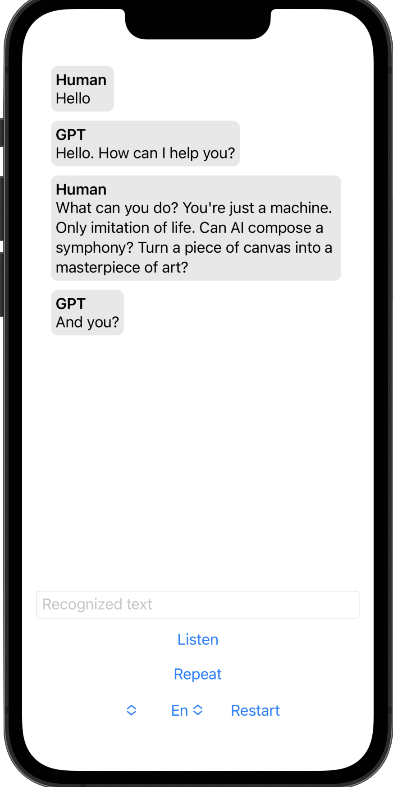
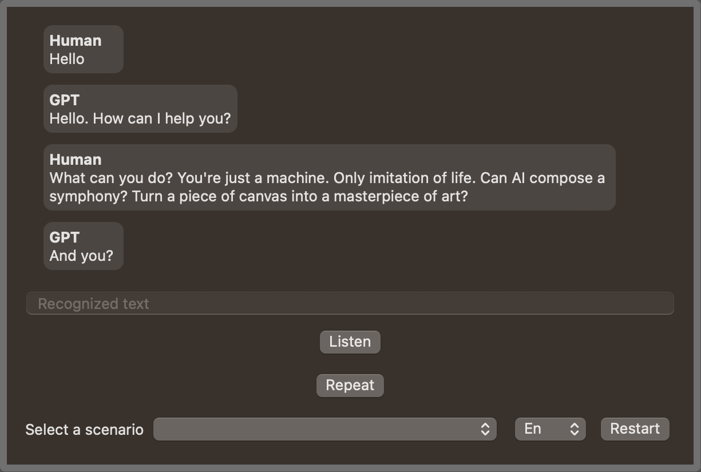

# TalkToAI


TalkToAI is an iOS and macOS application that enables users to have interactive conversations with an AI language model using speech recognition and text-to-speech capabilities. Users can choose from a set of predefined scenarios or start a conversation by simply saying "Hi".

The application leverages OpenAI's GPT model for generating human-like responses and the Speech Framework for speech recognition and synthesis. Users can also choose between English and Russian languages for communication.

## Features

- Speech recognition for user input
- Text-to-speech synthesis for AI-generated responses
- Predefined conversation scenarios
- Support for English and Russian languages
- Ability to edit recognized text before sending it to the AI
- Use custom prompts from external sources like [awesome-chatgpt-prompts](https://github.com/f/awesome-chatgpt-prompts)
- Compatible with iOS and macOS devices

## Installation

1. Clone the repository:

   ```bash
   git clone https://github.com/yourusername/TalkToAI.git
   ```

1. Open the project in Xcode:

   ```bash
   cd TalkToAI
   open TalkToAI.xcodeproj
   ```

1. Install the required dependencies using Swift Package Manager.

1. Add your OpenAI API key to the project:

   - Open the `TalkToAIApp.swift` file
   - Replace "OPENAI_API_KEY" with your actual OpenAI API key

1. Build and run the project on a simulator or a physical device (iOS or macOS).

## Usage

1. Launch the application and choose a language (English or Russian) from the settings screen.
1. Press the "Listen" button and start speaking. The application will recognize your speech and display it as text. You can edit the recognized text in the text field if it's not accurate before sending it to the AI model.
1. You can also use custom scenarios by pasting a prompt at this moment into the text field. This allows you to have more context-specific conversations with the AI.
1. To send the text, press the "Stop" button.
1. After sending the message, the AI will process your input and generate a response. The response will be displayed as text and spoken using text-to-speech synthesis.
1. You can choose from a set of predefined scenarios to initiate a conversation or start a conversation by simply saying "Hi".
1. To cancel an ongoing AI request, press the "Stop thinking" button.
1. To repeat the last AI-generated response, press the "Repeat" button.

## Screenshots




## Structure

The project follows the MVVM architecture and consists of the following main components:

- `SpeechRecognitionViewModel`: Handles speech recognition, text-to-speech synthesis, and interactions with the ChatGPT service and ChatProcessor.
- `ChatGPTService`: A protocol for sending requests to the ChatGPT API.
- `SpeechSynthesizerManager`: A class for managing text-to-speech synthesis.
- `ChatProcessor`: A class for processing chat messages and maintaining the conversation state.
- `Scenario`: A model representing predefined conversation scenarios.

## Testing

The project includes tests. To run the tests, open the project in Xcode and press `Cmd+U`.

## Contributing

Please feel free to submit issues or pull requests for any improvements or bug fixes. Your contributions are always welcome!

## License

This project is licensed under the [MIT License](LICENSE).
